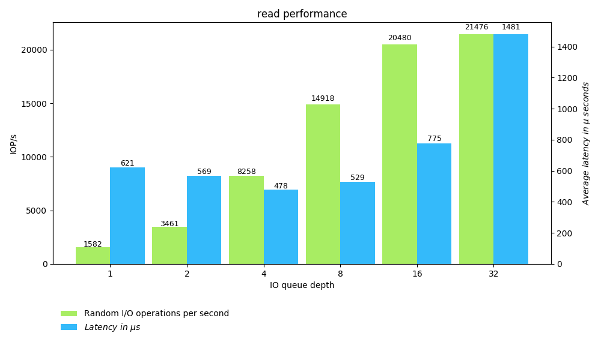
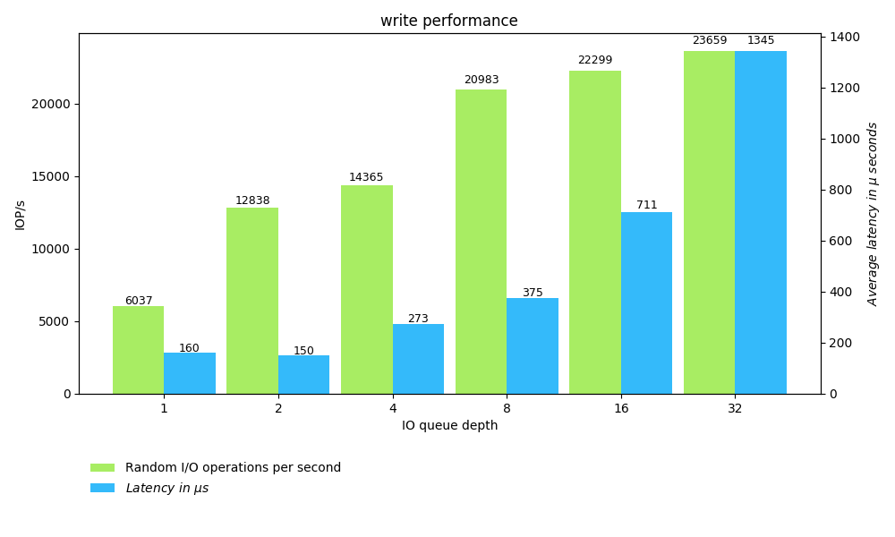
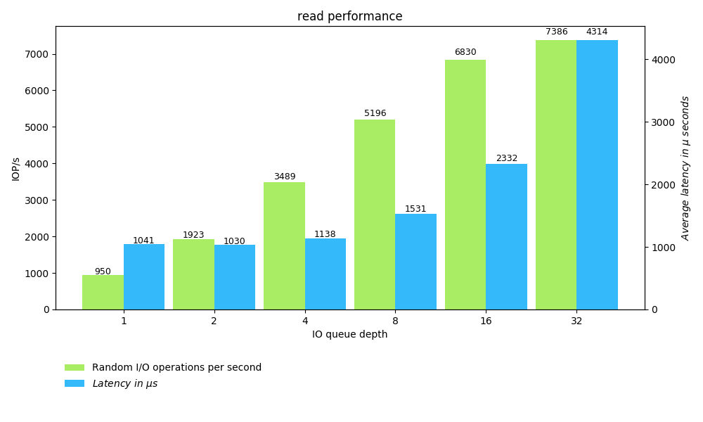
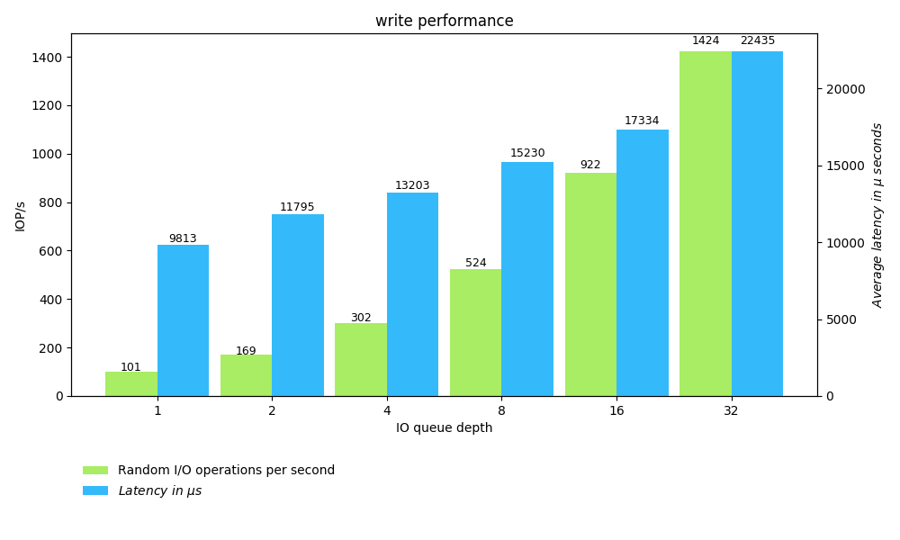
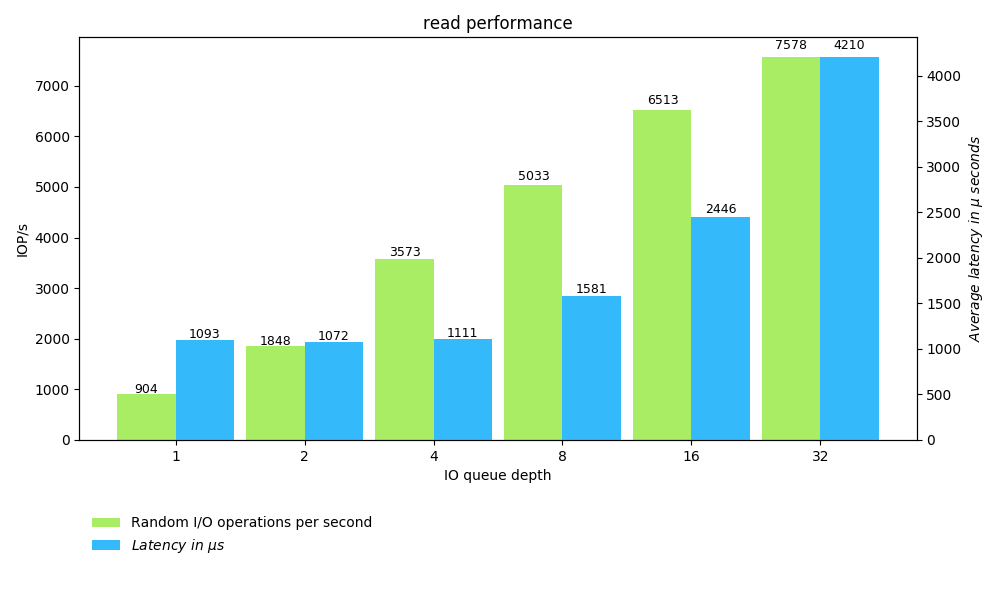
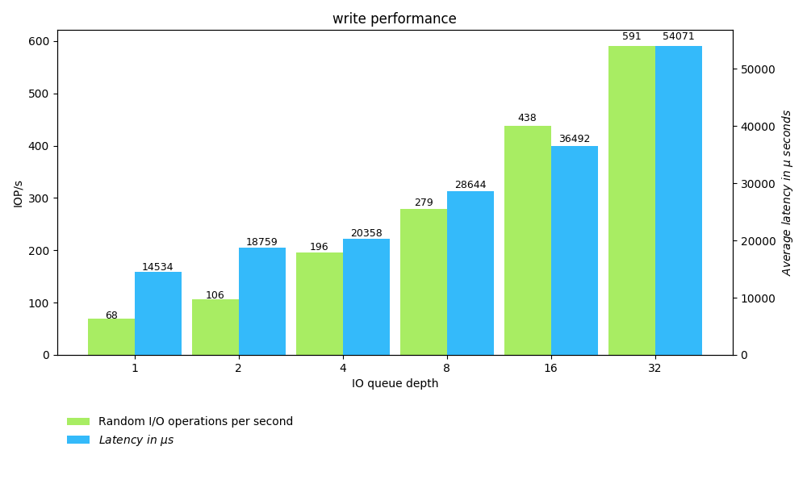

# Benchmarking Kubernetes Volumes with fio

[Fio](https://fio.readthedocs.io/en/latest/fio_doc.html) is a tool that spawn a number of threads or processes doing a particular type of I/O action.

This project is composed of a containerized application that generates benchmarks using the fio tool and plots the results into graphics.


## Initial concepts

* **StorageClass**
[[docs]((https://kubernetes.io/docs/concepts/storage/storage-classes/))]
provides a way for administrators to describe “classes” of storage

* **PersistentVolume**:
[[docs](https://kubernetes.io/docs/concepts/storage/persistent-volumes/)]
A piece of storage in the cluster that has been provisioned by an administrator.

* **PersistentVolumeClain**
[[docs](https://kubernetes.io/docs/concepts/storage/persistent-volumes/#lifecycle-of-a-volume-and-claim)]
Request storage from PersistentVolume or directly from StorageClass.


* **I/O**: Transaction between the application and storage

* **IOPS**: I/O Operations per Second  (i.e. how many data requests can be performed from a server to a storage system per second)

* **Latency**: How long it takes for particular request to be responded to by storage


## Worloads

The workloads benchmarking Storage performace depends on the application goals, e.g.:
* A transaction model, such as a database, has a relative small I/O, increasing the IOPS, and demands low latency
* In a backup context, the I/O is large, decreasing the IOPS and latency it is not critical

Some characteristics defines how to configure the workloads, e.g.:
* **Pattern**:  Random and Sequential
* **Operation** Size: IO unit (e.g., 4KB, 64KB)
* **Read/Write**: Read, Write or MIX

```
Online Transational Processing Database Workload
===============================
Pattern...............Random
Operation Size........8K
R/W...................Mix 70/30
```

```
Database Backup Workload
================================
Pattern...............Sequential
Operation Size........64K
R/W...................Read
```

```
Video Workload
================================
Pattern...............Sequential
Operation Size........512K+
R/W...................MIX
```

> [Understanding Lantency and Storage Performace](http://louwrentius.com/understanding-iops-latency-and-storage-performance.html)

## Project Structure

* [gen-data](./gen-data): For each I/O Depth Queue in [ 01 02 04 08 16 32 ] (high I/O Depth icreases the latency), performs a fio-job based on [template](./gendata/job-templates), that can be configured by a [ConfigMap](./manifests/configmap.yaml), whose output is saved into JSON files.
    * Currently, this project uses the random pattern for Read and Write modes

* [gen-plots](./gen-plots): Consumes the data generated by the previous step and generate the latency + iops charts for each mode (read/write)

* [http-server](./http-server): Is a simple HTTP server to show the generated data by `gen-data` and `gen-plots`.


## Examples

The [**Local Storage**](https://kubernetes.io/docs/concepts/storage/storage-classes/#local) selects some cluster nodes
(using [Node Affinity](https://kubernetes.io/docs/concepts/configuration/assign-pod-node/#affinity-and-anti-affinity)) to create PersistentVolumes on them, e.g.:

```yaml
kind: StorageClass
apiVersion: storage.k8s.io/v1
metadata:
  name: local
provisioner: kubernetes.io/no-provisioner
volumeBindingMode: WaitForFirstConsumer
---
apiVersion: v1
kind: PersistentVolume
metadata:
  name: local
spec:
  capacity:
    storage: 5Gi
  volumeMode: Filesystem
  accessModes:
  - ReadWriteOnce
  persistentVolumeReclaimPolicy: Delete
  storageClassName: local
  local:
    path: /mnt/disks/ssd1 # Mount this path fo the data
  nodeAffinity:
    required:
      nodeSelectorTerms:
      - matchExpressions: # If the node has the label disktype=ssd
        - key: disktype
          operator: In
          values:
          - ssd
---
kind: PersistentVolumeClaim
apiVersion: v1
metadata:
  name: local
spec:
  storageClassName: local
  accessModes:
    - ReadWriteOnce
  resources:
    requests:
      storage: 5Gi
```

The [**Rook**](https://rook.github.io/docs/rook/master/ceph-quickstart.html) allows us to manage ceph clusters, that can be used for:
* **Block Storage**: Create block storage to be consumed by a pod
* **Object Storage**: Create an object store that is accessible inside or outside the Kubernetes cluster
* **Shared File System**: Create a file system to be shared across multiple pods


The example bellow deploys a Rook-Ceph-Cluster for Block Storage:

Deploying Rook Operator: Enable to create custom resources managed Rook (e.g., Cluster, Pool etc)
```bash
kubectl apply -f \
  https://raw.githubusercontent.com/rook/rook/master/cluster/examples/kubernetes/ceph/operator.yaml
```

Deploying [Ceph Cluster](https://rook.github.io/docs/rook/master/ceph-cluster-crd.html):
```bash
kubectl apply -f \
  https://raw.githubusercontent.com/rook/rook/master/cluster/examples/kubernetes/ceph/cluster.yaml
```

Deploying a [Ceph Pool](https://rook.github.io/docs/rook/master/ceph-pool-crd.html) (not replicated):
```bash
kubectl apply -f \
  https://raw.githubusercontent.com/rook/rook/master/cluster/examples/kubernetes/ceph/pool.yaml
```

**OR**  (relicated: 3)
```yaml
cat <<EOF | kubectl create -f -
apiVersion: ceph.rook.io/v1beta1
kind: Pool
metadata:
  name: replicapool
  namespace: rook-ceph
spec:
  failureDomain: osd
  crushRoot: default
  replicated:
    size: 3
EPF
```

Once you have a Persistent Volume Clain you can configure the fio options in the [ConfigMap](./manifests/configmap.yaml) and map `PersistentVolumeClaim` name, in the `Deployment` [manifest](./manifests/deploy.yaml#17).

The examples (Charts and benchmark outputs) using Local Storage Class and using Rook-Ceph (no-replicated and replicated) can be found [here](./examples/)

Randread Local Storage:



Randwrite Local Storage:



Randread Ceph:



Randwrite Ceph:



Randread Ceph (replicated=3):



Randwrite Ceph (replicated=3):


